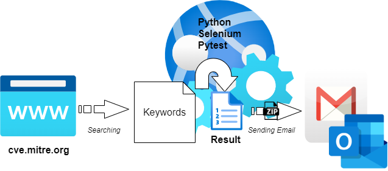

# Project : CVE Scanning Automation
## Purpose
 The customer's request about the monitoring of some keywords' searching results in http://cve.mitre.org website has occurred. The website is for managing SW vulnerability DB and is operated by one of the US government-affiliated institutes. The keywords have been defined through the discussion with the customer. These keywords' searching is a kind of simple but repetitive task. So I made this simple project to relieve the tedium.  

## Used major technique
- Python 3
- Selenium
- Pytest

## Simple Diagram and Sequences
- Diagram

    
     
    

- Sequences
  - 1st. Keywords searching will be executed on the website using pytest and selenium. If the keywords' search results are different compared to the last week's result, the web page including the different results would be captured and inserted in the result.
  - 2nd. If the keywords searching has finished well, a draft result file format: XML is going to be converted to HTML.
  - 3rd. The converted HTML format result file will be archived with a CSS file prepared in advance for visibility.
  - 4th. The archived file will be sent to the target e-mail address. (End)
